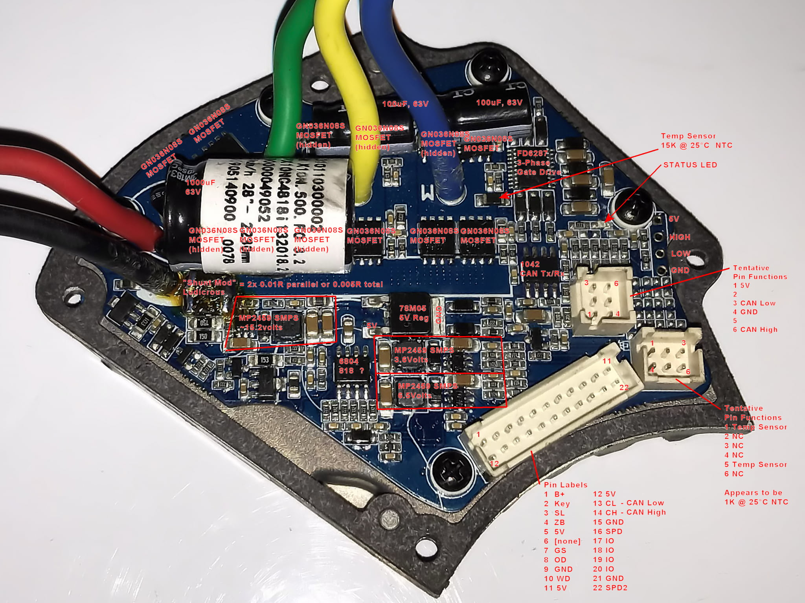
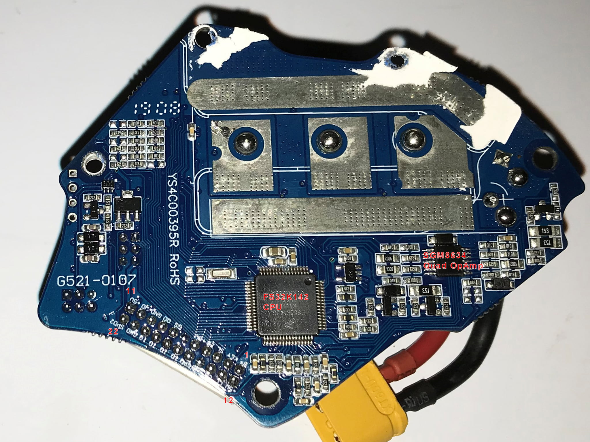

# Hardware Information for M500 and M600

## Connectors

The connectors use a so called "[Higo Mini-F](https://www.higoconnector.com/news/compact-transmission-connector-range)" connector for all wiring.

You can buy the connectors here:
* Aliexpress: [here](https://pt.aliexpress.com/item/1005003656557018.html?spm=a2g0o.store_pc_groupList.8148356.27.4e914f25zRBciU) or search for "Mini J Signal Connector Cable for Bafang M500 M600"
* [e-bike-technologies](https://www.e-bike-technologies.de/index.php/en/connectors/connectors-signal/connectors-higo-mini-f-series)

### Connectors on the motor

[See here the connectors pins description](Bafang_M500_M600_Connectors.pdf). 

### Connection diagram

## M600 Teardown

A good teardown video for the M600 is available on youtube:
https://www.youtube.com/watch?v=muSNIUXNNaQ

## Specifications

### M500

### M600

## Battery

For both models the official Bafang battery includes a connector that might in the future include CANBUS integration for the battery.
However: The motor controller, as of July 2021, does not require the battery to be CANBUS connected to function. This means connecting the battery power-wires to the motor controller is enough.

## Power

### M600

The M600 is available in the following variants:
- 36v/15A
- 36v/25A
- 43v/20A
- 48v/10A 
- 48v/18A 

### M500

The M500 is available in the following variants:
- 36v/15a
- 36v/17a
- 48v/10A 
- 48v/12A 

### Custom power setups

Most of these differences are in firmware and not in hardware, so there might be more or less variants out there than listed.
It is, however, possible to run the 43v/20A firmware with a 48v battery, this would increase the max power output, but you might risk the battery being deep-drained, due to a too low cutoff voltage in the controller.

It's also possible to run the 48v/18a variant on a 52v battery, as indicated here:
https://www.youtube.com/watch?v=X2IPtda_LFo

It should be noted that there is a safety cutoff for 48v controllers, that disables the motor if the battery voltage is above 58v. You should charge the 52v cells accordingly.

The reason Bafang does not supply a 52v battery (and you also don't have to try and ask them for it), is because the EU does not allow more than 48v charger connections  CE certification.
The difference between 52v or 48v are, however, very small so it wouldn't actually pose a risk. But for Bafang they cannot supply it within regulations.

## Electo Motor and nominal Wattage

### Nominal Wattage

The nominal wattage, according to EU regulations, is determined by measuring the temperature at a certain continues load. This means that to comply to EU regulations, the actual **physical** motor unit has to be different.

Bafang has done this by adapting the stator size (the power coil):

M600:
Size: 72.4mm
Rating: 500w Nominal

M500:
Size: 63.4mm
Rating: 250w Nominal

### M500 vs M600

The M500 has, in fact, a motor unit that has a 250w rated stator. Whereas the M600 has a 500w rated stator. At the time of writing it's not 100% sure if the rotor also has significant changes between versions, besides the axle difference noted below.
In practice this means that the M500 WILL overheat quicker than the M600. For this reason it's adviced not to run the M500 above 18A.

## Gearing

### M500 vs M600

The M500 and M600 are mostly similair, with some exceptions:

- The M500 and M600 motors, use a plastic gear on the first reduction. In the 2019/2020 period, the gears on the M600 were all metal.
- The gears of the two motors have a slightly different pitch

Gear ratio's:
M600: 6:27
M500: 7:32

Here are a few pictures of people trying to find the stock gearing part numbers:
`TODO: Insert images`

### Increasing motor power on the M500 (and gearing)

The plastic gear in the M500, will NOT survive extremely increased power targets.
If you go much above 13A it's adviced to have it replaced by a metal gear.

### Rotor Axle

The rotor of the M600 has a different (longer/bigger) axle. This prevents easy swap of rotors between the two types and adding a M600 gearbox to the M600.
It is, however, possible using professional mechanic equipment to build a M500 rotor with M600 axle. It has been done, but requires significant skill and knowhow.

## Controller hardware module

### Teardown

These pictures highlight the most important components on the Controller Hardware Module

### Controller SoC

The controller SoC seems to be a S32K142H NXP SoC

Datasheet:
https://github.com/OpenSourceEBike/Bafang_M500_M600/blob/main/Hardware/S32K-DS.pdf

### MOSFETS

The Board containers 2 MOSFETS for each PHASE, with a total of 6.
The MOSFET(s) seem to be HGN036N08S, which are 80V/60A rated but seemingly not adequately/optimaly cooled.

Datasheet:
https://github.com/OpenSourceEBike/Bafang_M500_M600/blob/main/Hardware/HGN036N08S_V1.0-061417.pdf

### Power measurement and phase control

The M500 board contains 1 shunt resistor of 6 milliohms. The M600 board seems to contain 2 shunt resistors in parallel (unknown value).

### Magnetic Rotary Encoder IC

There is a magnetic rotary enconder on the board (on the center of the circle, on the silkscreen), the [MT6804](Controller/MT6804.pdf). This encoder detects the position angle of the magnet that is glued on the motor shaft and with this information will know the rotor angle that is needed to implement the best motor control possible, to have a good torque at motor startup as also a silent and efficient motor. This is the reason why the motor does not have hall sensors (they provide a much worse rotor angle) nor motor phase current sensors on the board, since they would be needed to implement a sensorless algorithm to detect the rotor angle.

### M500 vs M600

It should technically be possible to transplant a M600 module into a M500, however: one would need to change the wiring from the board to the motor (phase wires) in such a way that the colors line up.
The differences are mostly the fact that the M500 has 1 instead of 2 shunt resistors in the M600.

## Links

FS32K142 main page ARM Cortex CPU
https://www.nxp.com/part/FS32K142HAT0MLHT#/

datasheet
https://www.nxp.com/docs/en/data-sheet/S32K-DS.pdf

FD6287 3-phase gate driver (can't seem to find datasheet)
https://assets-stash.oss-cn-shanghai.aliyuncs.com/forum/201910/10/105844o2cthp7r7qz0zizr.png
https://mbb.eet-china.com/forum/topic/73906_1_1.html

1042 CAN Transciever
https://www.ti.com/lit/ds/symlink/tcan1042-q1.pdf

SGM8634 Quad OpAmp
https://pdf1.alldatasheet.com/datasheet-pdf/view/224078/SGMICRO/SGM8634.html

GN036N08S Power Mosfets
http://www.hunteck.com/Datasheets/HGN036N08S_V1.0-061417.pdf

M600 Motor Controller
https://flx.bike/products/M600-motor-controller-version-3-2

Development Boards and typical controller schematic
https://www.nxp.com/design/development-boards/automotive-motor-control-solutions/arm-based-solutions-/s32k142-development-board-for-bldc-pmsm-motor-control:MCSXTE2BK142
