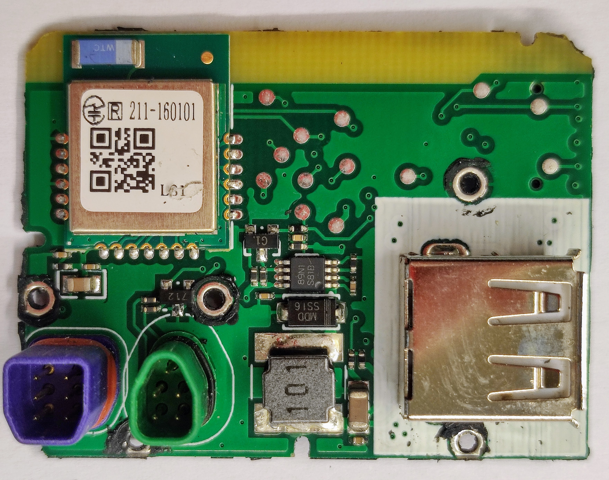
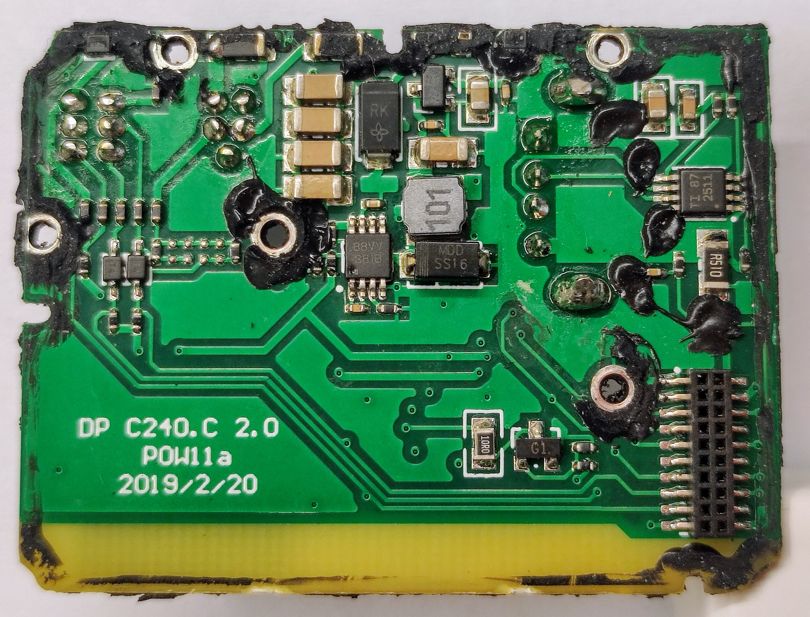
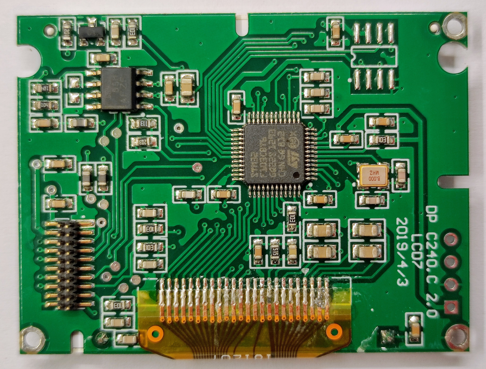
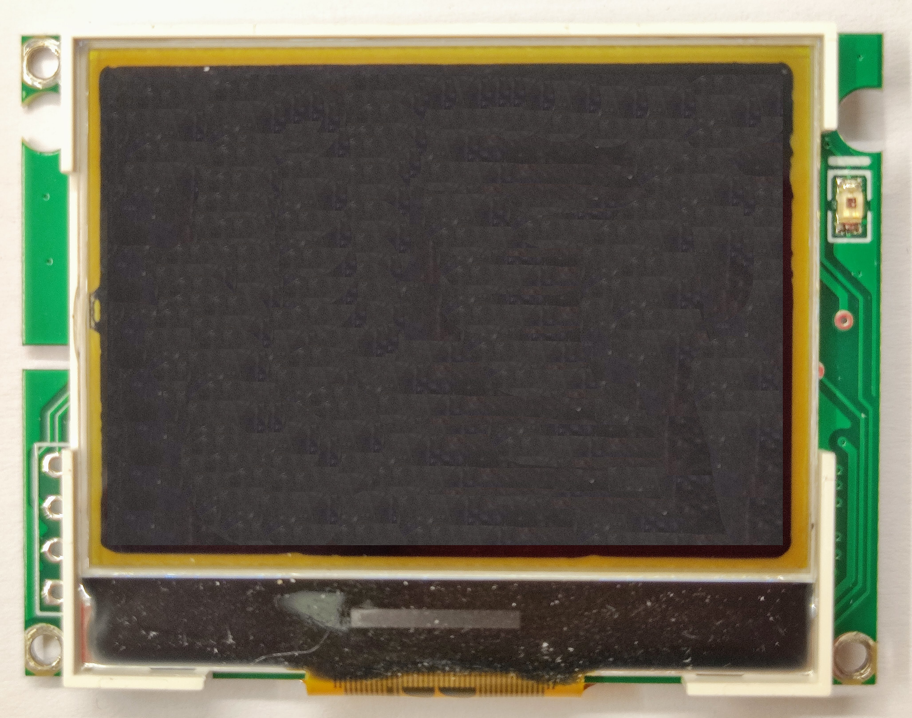

# Display DP C240 / C241

Seems this displays are just only one, that always include the Bluetooth hardware but probably the DP C240 has a different firmware with Bluetooth disabled.

## Pictures of internals

 
On bottom left the connectors. Purple / blue connector connects to the motor controller. The green connector connects to the remote keypad.

On top left is the Bluetooth module.

On bottom right is the USB connector for charging a device. That coil, diode and IC should part of the circuit to regulate and protect on the power to charging provided on the connector.

 
This side of the board had probably the DC-DC to convert the battery voltage to display voltage like maybe 5V or 3.3V. It may also have the circuit to turn on/off the motor controller.

 
The microcontroller of this display, the famous STM32F103C8T6.

 
The display. At right side, that is probably a light sensor.

# How to turn on/off the Bafang M500/M600 motor controller

There are 5 pins to connect the display to the motor controller:
- GND (Ground)
- CAN_H (CANBUS High)
- CAN_L (CANBUS Low)
- CTRL (Enable / disable the motor controller)
- VBAT (Voltage battery to power the display)

 The on/off button on the display pulls the CTRL wire (it has battery voltage from a pull up resistor) to ground. This signals the motor controller to put the battery voltage on the VBAT wire as supply for the display. If the motor controller gets no valid CAN messages from the display, it switches off the VBAT wire (put GND on VBAT wire), turning off the display, supply after a few seconds.

[Log of CAN messages when display turns on](Display/DP_C240_241/CAN_stop_sequence.txt).

[Log of CAN messages when display turns off](Display/DP_C240_241/CAN_stop_sequence.txt).

