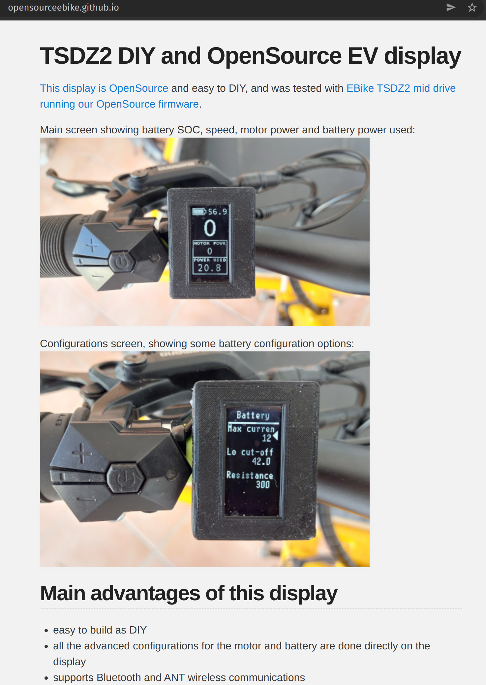

# Bafang M500 and M600 Modification Project

This project aims to provide guidance for modifying the Bafang m500 and m600 motors. Eventually we hope to be able to provide a fully opensource firmware, but for the time being we provide hacked firmwares and documentation.

## How to colaborate

Help test our firmwares, join discussions, fork the repository or send us relevant information either by github-issue or [write a message on the forum](https://endless-sphere.com/forums/viewtopic.php?f=28&t=100777).

## How to build your EBike
* See [this video](https://www.youtube.com/watch?v=ot8rxRnd2DQ) on how to build an EBike with Bafang M500 and Dengfu E10 carbon fiber frame. See also [the review video of that EBike](https://www.youtube.com/watch?v=RvFD0Q909ZY) and the [forum message for the build process](https://www.emtbforums.com/community/threads/my-chinese-frame-and-motor-build-the-cheeb-v1-0-build-thread.17725/). There are many other forum messages about bulding an EBike with Bafang M500/M600 motors
* You can buy the Dengfu E10 frame - search on Ebay, Aliexpress or [contact directly Dengfu](http://www.dengfubikes.com)
* You can buy your motor or battery from Dengfu or from [GreenBikeKit](https://www.greenbikekit.com/bafang-8fun-spare-parts/bafang-m600-m500-motor-with-parts.html)
* For maintenance or repair, you can buy all the motor parts, display and battery on [GreenBikeKit](https://www.greenbikekit.com/bafang-8fun-spare-parts/bafang-m600-m500-motor-with-parts.html)

## Ideas for projects
### DIY OpenSource display
Adapt the [EBike DIY OpenSource display](https://opensourceebike.github.io/) to control and show the motor data. We know the CAN commands to read all data from the controller and to change max speed and wheel diameter. It should also be possible to flash the motor firmware. A display button combination can be used to quick change max speed (offroad mode).

Needed steps:
* Adapt the [EBike DIY OpenSource display](https://opensourceebike.github.io/) hardware by adding a SPI CAN module (cheap Arduino CAN module) to be able to communicate with Bafang M500/M600 motors
* Add the CAN commands to the firmware and adapt the information being shown on the screen 

Pictures pf [EBike DIY OpenSource display](https://opensourceebike.github.io/):

## Project structure

- `/BESST` -  Provides sourcecode and older versions to research the BESST software package
- `/CANBUS` - Provides documentation on the inner workings of the Bafang CANBUS protocol
- `/Firmwares/Official` - Provides firmwares originally provided by Bafang themselves
- `/Firmwares/Custom` - Provides hacked firmwares created by this projects, that contain customised settings
- `/hardware` - Provides Documentation for everything we know about the Bafang hardware and it's controller

## Disclaimer

All the code, programs, dumps, images and information in this repository is supplied solely for educational use.
