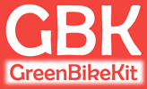

**Table of Contents**
- [Bafang M500 and M600 community OpenSource development](#bafang-m500-and-m600-community-opensource-development)
  - [How to colaborate](#how-to-colaborate)
  - [Project structure](#project-structure)
  - [How to build your EBike with M500/M600 motor](#how-to-build-your-ebike-with-m500m600-motor)
  - [Maintenance and repair](#maintenance-and-repair)
  - [Configuration and diagnostics](#configuration-and-diagnostics)
  - [Ideas for projects](#ideas-for-projects)
    - [DIY OpenSource display](#diy-opensource-display)
    - [Develop our own firmware for the original motor controller](#develop-our-own-firmware-for-the-original-motor-controller)
  - [Disclaimer](#disclaimer)

# Bafang M500 and M600 community OpenSource development

## How to colaborate

Help test our firmwares, join discussions, fork the repository or send us relevant information either by github-issue or [write a message on the forum](https://endless-sphere.com/forums/viewtopic.php?f=28&t=100777) or chat with us on [this Telegram channel](https://t.me/bafang_m500_m600_development).

**Discount code for developers** 
[GreenBikeKit](https://t.me/bafang_m500_m600_development) sells Bafang M500 and M600 motor kits, including the parts you may need to for maintenance and repair. If you are a developer, ask for the discount code on [the Telegram channel for development](https://t.me/bafang_m500_m600_development).

## Project structure

- `/BESST` -  Provides sourcecode and older versions to research the BESST software package.
- `/CANBUS` - Provides documentation on the inner workings of the Bafang CANBUS protocol.
- `/Firmwares/Official` - Provides firmwares originally provided by Bafang themselves.
- `/Firmwares/Custom` - Provides hacked firmwares created by this projects, that contain customised settings.
- `/hardware` - Provides Documentation for everything we know about the Bafang hardware and it's controller.

## How to build your EBike with M500/M600 motor

* See [this video](https://www.youtube.com/watch?v=ot8rxRnd2DQ) on how to build an EBike with Bafang M500 and Dengfu E10 carbon fiber frame. See also [the review video of that EBike](https://www.youtube.com/watch?v=RvFD0Q909ZY) and the [forum message for the build process](https://www.emtbforums.com/community/threads/my-chinese-frame-and-motor-build-the-cheeb-v1-0-build-thread.17725/). There are many other forum messages about bulding an EBike with Bafang M500/M600 motors.
* You can buy the Dengfu E10 frame - search on Ebay, Aliexpress or [contact directly Dengfu](http://www.dengfubikes.com).
* You can buy your motor or battery from Dengfu or from [GreenBikeKit](https://www.greenbikekit.com/bafang-8fun-spare-parts/bafang-m600-m500-motor-with-parts.html).
* For maintenance or repair, you can buy all the motor parts, display and battery on [GreenBikeKit](https://www.greenbikekit.com/bafang-8fun-spare-parts/bafang-m600-m500-motor-with-parts.html).

## Maintenance and repair

See the **[notes about the maintenance and repair of M500/M600 motor](maintenance_and_repair.md)**.

## Configuration and diagnostics

You can use software called [OpenBafangTool](https://github.com/andrey-pr/OpenBafangTool) to configurate your motor (and other components) or to get diagnostic information (data from inner sensors, error codes)

## Improve your Bafang M500/M600 EBike 

Build your own **[EasyDIY OpenSource display](https://opensourceebike.github.io/)** that is a fully replacement of the original display, but let you configure the motor max speed and wheel perimeter. It also shows you advanced data like battery current, voltage and motor power. And for the ones that use a cycling GPS computer Garmin Edge, this display also implements the ANT+ LEV EBike wireless and sends to the Edge the battery SOC and assist level, as also let you change the Edge page by clicking on the remote button:

## Ideas for projects

### Develop our own firmware for the original motor controller

See **[Develop motor controller firmware](develop_motor_controller_firmware.md)**.

## Disclaimer

All the code, programs, dumps, images and information in this repository is supplied solely for educational use.
